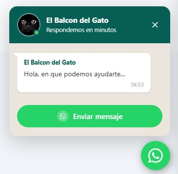

# @tavosud/floating-button-whatsapp-modern

Fully customizable WhatsApp floating button with a chat-style popup. Compatible with Vanilla JS, TypeScript, React, Vue, Angular, and any JavaScript/TypeScript framework.

[](https://www.npmjs.com/package/@tavosud/floating-button-whatsapp-modern)
[](https://opensource.org/licenses/ISC)
[](https://codesandbox.io/p/sandbox/floating-button-whatsapp-modern-8nss88)
[](https://ko-fi.com/tavosud)



---

## Features

- **WhatsApp-style popup** — header with avatar, online indicator, name and slogan; message bubble with sender name; pill-shaped send button
- **Shake animation** — the floating button periodically shakes to draw attention (every 6 s, pauses on hover)
- **Fully customizable** — 9 color properties + position, text, and more
- **Zero dependencies** — no production dependencies
- **Standalone CSS** — includes a standalone `.css` file for CDN usage
- **ESM and CJS formats** — compatible with modern bundlers and Node.js
- **Native TypeScript** — types included

---

## Installation

```bash
npm install @tavosud/floating-button-whatsapp-modern
```

---

## Quick start

### Vanilla JS / TypeScript

```ts
import { createWhatsAppButton } from '@tavosud/floating-button-whatsapp-modern';

createWhatsAppButton({
  phone:   '51987654321',         // required — include country code
  name:    'Support',
  slogan:  'We reply in minutes',
  avatar:  'https://example.com/photo.jpg',
  message: 'Hi, I have a question about...',
});
```

### HTML (CDN / script tag)

Include the standalone CSS and the JS module:

```html
<!-- Base styles (optional if already included by your bundler) -->
<link rel="stylesheet" href="https://unpkg.com/@tavosud/floating-button-whatsapp-modern/dist/floating-button-whatsapp-modern.css">

<script type="module">
  import { createWhatsAppButton } from 'https://unpkg.com/@tavosud/floating-button-whatsapp-modern/dist/index.esm.js';

  createWhatsAppButton({
    phone:   '51987654321',
    name:    'Sales',
    slogan:  'Hi! How can we help you?',
    message: 'Hello, I would like more information.',
  });
</script>
```

### React

```tsx
import { useEffect, useRef } from 'react';
import { WhatsAppButton } from '@tavosud/floating-button-whatsapp-modern';

export function WhatsAppWidget() {
  const btnRef = useRef<WhatsAppButton | null>(null);

  useEffect(() => {
    btnRef.current = new WhatsAppButton({
      phone:   '51987654321',
      name:    'Sales',
      slogan:  'Hi! How can we help you?',
      message: 'Hello, I would like more information.',
    });
    btnRef.current.mount();

    return () => btnRef.current?.unmount();
  }, []);

  return null;
}
```

### Vue 3

```ts
// composable: useWhatsApp.ts
import { onMounted, onUnmounted } from 'vue';
import { WhatsAppButton } from '@tavosud/floating-button-whatsapp-modern';

export function useWhatsApp() {
  let btn: WhatsAppButton;

  onMounted(() => {
    btn = new WhatsAppButton({
      phone:   '51987654321',
      name:    'Support',
      slogan:  'We reply in minutes',
    });
    btn.mount();
  });

  onUnmounted(() => btn?.unmount());
}
```

### Angular

```ts
// app.component.ts
import { Component, OnInit, OnDestroy } from '@angular/core';
import { WhatsAppButton } from '@tavosud/floating-button-whatsapp-modern';

@Component({ selector: 'app-root', templateUrl: './app.component.html' })
export class AppComponent implements OnInit, OnDestroy {
  private btn!: WhatsAppButton;

  ngOnInit() {
    this.btn = new WhatsAppButton({
      phone:   '51987654321',
      name:    'Support',
    });
    this.btn.mount();
  }

  ngOnDestroy() { this.btn.unmount(); }
}
```

---

## Options

| Property          | Type                   | Default                              | Description                                                                  |
|-------------------|------------------------|--------------------------------------|------------------------------------------------------------------------------|
| `phone`           | `string`               | **required**                         | Phone number with country code (digits only). E.g.: `'51987654321'`          |
| `name`            | `string`               | `'WhatsApp'`                         | Name shown in the popup header                                               |
| `slogan`          | `string`               | `'Typically replies in minutes'`     | Subtitle shown below the name                                                |
| `avatar`          | `string`               | *(generic icon)*                     | URL of the profile picture shown in the header                               |
| `message`         | `string`               | `''`                                 | Pre-filled message sent when opening WhatsApp                                |
| `position`        | `ButtonPosition`       | `'bottom-right'`                     | Button position: `'bottom-right'` \| `'bottom-left'` \| `'top-right'` \| `'top-left'` |
| `sendButtonLabel` | `string`               | `'Send message'`                     | Label for the send button                                                    |
| `autoOpenDelay`   | `number`               | `0`                                  | Milliseconds before the popup opens automatically. `0` = disabled           |
| `zIndex`          | `number`               | `9999`                               | z-index of the widget                                                        |
| `target`          | `string`               | `'body'`                             | CSS selector of the element where the widget will be mounted                 |
| `colors`          | `WhatsAppButtonColors` | *(official WhatsApp colors)*         | Color customization object (see table below)                                 |

### Colors (`colors`)

| Property                    | Default     | Description                                        |
|-----------------------------|-------------|----------------------------------------------------|
| `headerBackground`          | `#075E54`   | Background color of the popup header               |
| `headerText`                | `#FFFFFF`   | Text and icon color in the header                  |
| `bodyBackground`            | `#ECE5DD`   | Background color of the popup body                 |
| `buttonBackground`          | `#25D366`   | Background color of the floating button (FAB)      |
| `buttonIcon`                | `#FFFFFF`   | WhatsApp icon color in the FAB                     |
| `sendButtonBackground`      | `#25D366`   | Background color of the "Send message" button      |
| `sendButtonText`            | `#FFFFFF`   | Text color of the "Send message" button            |
| `messageBubbleBackground`   | `#FFFFFF`   | Background color of the message bubble             |
| `messageBubbleText`         | `#333333`   | Text color inside the message bubble               |

### Example with custom colors

```ts
createWhatsAppButton({
  phone:   '51987654321',
  name:    'My Company',
  slogan:  '24/7 Support',
  avatar:  '/img/logo.png',
  message: 'Hi! I would like to get more information.',
  colors: {
    headerBackground:        '#1A237E',
    headerText:              '#FFFFFF',
    bodyBackground:          '#E8EAF6',
    buttonBackground:        '#3F51B5',
    buttonIcon:              '#FFFFFF',
    sendButtonBackground:    '#3F51B5',
    sendButtonText:          '#FFFFFF',
    messageBubbleBackground: '#FFFFFF',
    messageBubbleText:       '#1A237E',
  },
});
```

---

## Instance API

```ts
const btn = new WhatsAppButton({ phone: '51987654321' });

btn.mount();    // Inserts the widget into the DOM
btn.open();     // Opens the popup programmatically
btn.close();    // Closes the popup
btn.toggle();   // Toggles open/closed
btn.unmount();  // Completely removes the widget from the DOM
```

---

## Distributed files

```
dist/
├── index.esm.js                          # ES Module (for bundlers: Vite, Webpack, etc.)
├── index.cjs.js                          # CommonJS (for Node.js / require)
├── index.d.ts                            # TypeScript types
├── types.d.ts                            # Auxiliary types
└── floating-button-whatsapp-modern.css   # Standalone CSS (for CDN or <link> usage)
```

---

## Build

```bash
npm install
npm run build
```

---

## License

ISC © Gustavo Cuyutupa
